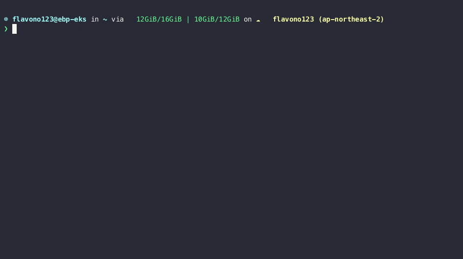

# `view-labels`

## *`show-labels` suck,  you can `view-labels` fastly and exactly*



A krew plugin to search with label keys for a resource.

## Install

```sh
kubectl krew add
kubectl krew install flew/view-labels
```

## Build

```sh
# TODO: should be done in CI
# personal workaround

# BUMP THE VERSION in Maekfile
make

# Test in local
cp build/kubectl-view_labels_<VERSION>_darwin_arm64 $HOME/.krew/kubectl-view_labels # i use m2 macbook
k view-labels no

# Publish
git tag <VERSION>
git push --tags
```
